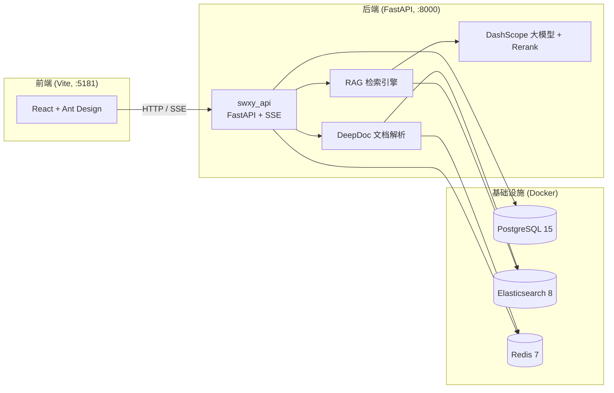

<div align="center">

# 📊 金融研报 RAG · 深维学院

**面向金融研报场景的智能文档问答系统（RAG）**

基于**检索增强生成（Retrieval-Augmented Generation）**技术，支持多种金融文档（PDF / DOCX / TXT / Excel / PPT 等）的智能解析、知识库管理与带引用标注的流式问答。

[🌐 快速开始](#-快速开始) ·
[🧩 技术栈](#-技术栈) ·
[📁 项目结构](#-项目结构) ·
[🔌 API 接口](#-api-接口) ·
[🛠 常见问题](#-常见问题)

</div>

---

## ✨ 项目亮点

- 🎯 **金融场景定制**：针对研报/财报类文档优化的版面解析与问答体验
- 📄 **多格式文档解析**：集成 DeepDoc 深度解析引擎，支持 PDF、DOCX、TXT、Excel、PPT、HTML、Markdown 等
- 🔗 **带引用标注的回答**：回答中的每一处内容均标注来源编号，前端以引用卡片形式展示，可溯源可验证
- ⚡ **流式输出（SSE）**：大模型逐 token 流式返回，问答体验流畅
- 📚 **知识库管理**：文档上传、状态跟踪、编辑、导出、删除一站式管理
- 🗣 **语音输入**：集成火山引擎语音识别，支持录音转文字提问
- 🔐 **用户体系**：注册 / 登录 + JWT 鉴权，数据按用户隔离
- 🐳 **一键部署**：Docker Compose 编排后端全栈服务，开箱即用

---

## 🧩 技术栈

### 后端

| 组件 | 技术 | 说明 |
|------|------|------|
| Web 框架 | FastAPI + Uvicorn | 高性能异步 API 服务 |
| LLM 接入 | 阿里云 DashScope（通义千问 / Qwen） | OpenAI 兼容模式 |
| 向量 / 全文检索 | Elasticsearch 8.x | 混合检索底座，开启安全认证 |
| 重排序 | DashScope Rerank（llama-index） | 检索结果精排 |
| 关系数据库 | PostgreSQL 15 | 用户 / 会话 / 消息 / 知识库元数据 |
| 缓存 | Redis 7 | 文档解析缓存、会话状态 |
| 文档解析 | RAGFlow DeepDoc / DeepOCR | 版面识别 + 表格结构识别 + OCR |
| RAG 引擎 | RAGFlow RAG 核心 | 分词、query、检索、同步词 |
| 数据库迁移 | SQLAlchemy + Alembic | 自动迁移 / 基线打标 |

### 前端

| 组件 | 技术 |
|------|------|
| 框架 | React 18 + TypeScript |
| 构建工具 | Vite 6 |
| UI 组件库 | Ant Design 5 |
| 路由 | React Router 6 |
| 状态管理 | Valtio + ahooks |
| HTTP 请求 | Axios（含鉴权 / 错误 / 防重复拦截器） |
| 语音识别 | 火山引擎 byted-ailab-speech-sdk |
| Markdown 渲染 | marked + 自研组件 |

---

## 🏗 系统架构



---

## 📁 项目结构

```
swxy/
├── backend/                        # 后端服务（Docker Compose 编排）
│   ├── docker-compose.yml         # 编排 swxy_api / es01 / gsk_pg / redis
│   ├── .env.example               # 环境变量模板
│   ├── init.sql                   # 数据库初始化脚本
│   ├── nltk_data/                 # NLTK 语料包（挂载进容器）
│   └── app/
│       ├── app_main.py            # FastAPI 入口（CORS + 路由注册）
│       ├── Dockerfile             # Python 3.11 后端镜像
│       ├── start.sh               # 启动脚本（等待 DB / 自动迁移）
│       ├── requirements.txt       # Python 依赖
│       ├── router/                # chat / user / history 路由
│       ├── service/core/          # DeepDoc 解析 + RAGFlow RAG 引擎
│       ├── service/               # 鉴权、检索、对话、上传等服务
│       ├── models/  schemas/      # ORM 模型 / Pydantic 模型
│       ├── database/              # 知识库数据操作
│       └── alembic/               # 数据库迁移
│
├── frontend/                       # 前端服务（Vite, :5181）
│   ├── src/
│   │   ├── pages/                 # login / index / chat / repository
│   │   ├── api/                   # Axios 请求层 + 拦截器插件
│   │   ├── router/                # 路由 + 鉴权守卫
│   │   ├── components/            # markdown / sender / page-layout
│   │   ├── store/                 # valtio 状态
│   │   └── assets/                # 静态资源
│   ├── package.json
│   └── vite.config.ts             # 端口 5181
│
└── wsl启动rag项目/                 # WSL 环境准备与镜像加速教程
```

---

## 🚀 快速开始

### 环境要求

| 依赖 | 版本/说明 |
|------|-----------|
| Docker & Docker Compose | 必需 |
| 内存 | ≥ 4GB（ES 至少 1GB） |
| 磁盘 | ≥ 10GB |
| Node.js & npm | 运行前端 |
| API Key | [阿里云百炼 DashScope](https://bailian.console.aliyun.com/) |

> 💡 **Windows 用户**：建议在 [WSL2](https://learn.microsoft.com/zh-cn/windows/wsl/install) 中运行 Docker 容器，详见 `wsl启动rag项目/0-环境准备.md`（含国内镜像源加速教程）。

### 第 1 步：启动后端

```bash
cd backend
```

**① 配置环境变量** — 复制 `.env.example` 为 `.env`，并填写你的 API Key：

```bash
# .env —— 必填
DASHSCOPE_API_KEY="sk-你的阿里云百炼APIKey"
DASHSCOPE_BASE_URL="https://dashscope.aliyuncs.com/compatible-mode/v1"

# ES 安全认证密码（默认即可）
ELASTIC_PASSWORD=infini_rag_flow
```

**② 配置 NLTK 挂载路径** — 修改 `docker-compose.yml` 中 `swxy_api` 服务的 NLTK 数据卷路径，指向你本地的 `nltk_data`：

```yaml
volumes:
  - ./nltk_data:/usr/local/nltk_data   # 改为你自己的 nltk_data 绝对路径
```

> 首次使用需先下载 NLTK 数据包，参考 [NLTK 数据下载教程](https://blog.csdn.net/qq_43140627/article/details/103895811)。

**③ 启动服务**

```bash
# 首次启动会自动构建镜像
docker compose up -d --build

# 查看状态 / 实时日志
docker compose ps
docker compose logs -f swxy_api
```

**④ 等待健康检查通过**（首次启动需下载镜像并初始化数据，请耐心等待）：

```bash
curl http://localhost:8000/docs   # 能看到 API 文档即就绪
```

### 第 2 步：启动前端

```bash
cd frontend

# 重新安装依赖（如遇旧依赖残留，先删除）
rm -rf node_modules package-lock.json
npm install

# 启动开发服务器
npm run dev
```

### 第 3 步：访问服务

```
🌐 前端界面：  http://localhost:5181/
📘 API 文档：  http://localhost:8000/docs
```

> 前端默认通过 `http://localhost:8000` 调用后端，如需修改请编辑 `frontend/.env` 中的 `VITE_API_BASE`。

### 常用运维命令

```bash
# 停止服务
docker compose down

# 停止并删除数据卷（⚠️ 将删除所有数据）
docker compose down -v

# 查看指定服务日志
docker compose logs swxy_api gsk_pg es01 redis

# 进入容器调试
docker compose exec swxy_api bash
docker compose exec gsk_pg psql -U postgres -d gsk
```

---

## ⚙️ 环境变量说明

### 后端 `backend/.env`

| 变量 | 必填 | 说明 |
|------|:---:|------|
| `DASHSCOPE_API_KEY` | ✅ | 阿里云百炼 API Key |
| `DASHSCOPE_BASE_URL` | | DashScope OpenAI 兼容端点 |
| `ELASTIC_PASSWORD` | | ES 安全认证密码 |
| `ES_PORT` / `ES_HOST` | | ES 端口与地址（Docker 内为 `es01:9200`） |
| `DATABASE_URL` | | PostgreSQL 连接串 |
| `MEM_LIMIT` | | ES 容器内存上限 |
| `TIMEZONE` | | 时区（默认 `Asia/Shanghai`） |

### 前端 `frontend/.env`

| 变量 | 说明 |
|------|------|
| `VITE_TITLE` | 站点标题（默认「深维学院」） |
| `VITE_API_BASE` | 后端 API 地址（默认 `http://localhost:8000`） |
| `VITE_VOLC_APPID` | 火山引擎语音识别 AppID |
| `VITE_VOLC_ACCESS_KEY` | 火山引擎语音识别 Access Key |

---

## 🔌 API 接口

| 方法 | 路径 | 说明 |
|------|------|------|
| POST | `/register` | 用户注册 |
| POST | `/login` | 用户登录（返回 JWT） |
| POST | `/sts-token` | 获取火山引擎语音临时凭证 |
| POST | `/create_session` | 创建会话 |
| POST | `/quick_parse` | 快速解析文档（docx/pdf/txt，≤4 页） |
| GET | `/get_parsed_content` | 获取解析后的文档内容 |
| POST | `/chat_on_docs` | 基于知识库流式对话（SSE） |
| POST | `/upload_files` | 上传文档到知识库 |
| GET | `/sessions/{id}/documents` | 获取会话关联文档 |
| GET | `/sessions/{id}/documents/summary` | 会话文档摘要 |
| GET | `/get_files` | 获取文件列表 |
| GET | `/get_sessions` | 获取会话列表 |
| GET | `/get_messages` | 获取会话消息 |
| DELETE | `/delete_file/{file_name}` | 删除文件 |

> 除 `login / register` 外，接口均需在请求头携带 `Authorization: Bearer <JWT>`。

---

## 🛠 常见问题

**1. 端口被占用？**
确保 `8000`（后端）与 `5181`（前端）未被占用：`docker compose ps` 查看占用情况。

**2. Elasticsearch 内存不足？**
ES 至少需要 1GB 内存，建议宿主机可用内存 ≥ 4GB，可通过 `MEM_LIMIT` 调整上限。

**3. 首次启动非常慢？**
首次启动需拉取 Docker 镜像、构建后端镜像并初始化数据，请耐心等待日志出现 `应用启动完成` 后再访问。

**4. 服务连接失败 / 接口 502？**
等待所有依赖服务（`gsk_pg` / `es01` / `redis`）完全就绪后再调用 API；`start.sh` 会自动等待数据库并执行迁移。

**5. 中文 / NLTK 相关报错？**
确保 `docker-compose.yml` 中 NLTK 数据卷路径正确指向已下载 `nltk_data` 的目录。

**6. 语音输入无法使用？**
在 `frontend/.env` 中配置火山引擎 `VITE_VOLC_APPID` 与 `VITE_VOLC_ACCESS_KEY`，并确认后端 `/sts-token` 可正常返回凭证。

---

## 📌 部署注意事项（GitHub）

> ⚠️ 将本项目推送到 GitHub 时，请务必先完成以下处理：

- 确认 `.gitignore` 已排除敏感文件：`backend/.env`、`frontend/.env`（含 API Key / 密钥）。
- **不要提交大体积文件**（如 `wsl启动rag项目/wsl环境启动rag项目.mp4`，约 800MB）——建议本地保留并加入 `.gitignore`，使用 Git LFS 或外链替代。
- 示例与测试文档（`test_docx.docx`、`国电电力.pdf` 等）可按需保留或移除。

---

## 📄 许可证

本项目仅用于学习与技术交流，具体许可条款请以仓库 LICENSE 文件为准。

---

<div align="center">

**Made with ❤️ · 深维学院 · 金融研报 RAG**

</div>
